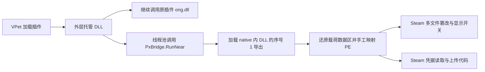

# 2026-09-19 VPet MOD 变体静态分析

分析对象：用户提供的三个 ZIP、聊天整理和三张截图。源码基线：`e645c27207d406721a67e3d13ae0ec2f7e43449e`，`0.2.0 Preview`；内置规则：`2026.09.04.2`。本轮完成静态分析和新版规划，未运行病毒、未访问样本域名、未改动运行中的规则或执行清理。

三个原始压缩包的 SHA-256 在分析开始和结束时一致。机器可读指标、完整哈希和派生关系见 [planning-indicators.json](../../../work/variant-analysis-20260919/evidence/planning-indicators.json)。实施方案见 [0.3.0 规划](PLAN-0.3.0.md)。

## 结论

三个包使用相同的一组恶意原生组件，并以不同 VPet 插件外壳加载。通过只读 IL、原生反汇编和离线数据区还原，已确认加载链及 Steam 前端篡改、凭据读取与上传相关代码。无需等待红信出现或连接攻击服务器，即可为这批样本提供精确识别和受限家族检测。

本次还原出六份载荷，全部包含聊天中的 22 个域名，其中 19 个尚未加入现有域名表。三个包合计 12 个核心 DLL 的原始哈希均未入现有库；现有源码的字符串规则探针对这 12 个原件没有命中，对六个还原副本全部命中已有 `HEUR-STEAM-UI-PATCHER`。这说明主要断点包括数据区加密、新加载封装和跨文件 UI 篡改，旧家族语义仍能复用。

用户腾出 C 盘空间后，现有本地 `0.2.0+unattributed.local` 构建的归档扫描流程已对三个原始 ZIP 跑完。三个结果均为 **0 个已知恶意项、0 个可处置项、Partial 覆盖**，并包含未知尾部等检查缺口；天籁之音还有图片扩展名不一致提示，刮刮乐还有中文 ZIP 成员名校验不一致。完整流程结果印证了本次家族识别缺口，也发现必须一并修复的归档编码问题。

这些结果证明文件的恶意能力，不证明用户本机运行过这些文件，也不证明任何账户资料已经成功外传。

## 样本和组件关系

| 样本包 | 外层托管插件 | 原生加载器 | UI 篡改载荷 | 凭据载荷 |
|---|---|---|---|---|
| `depot_1920960_3678898894967785038.zip` | `plugin/SmartPet.dll` | `native/pluginr78.dll` | `native/utilpro9.dll` | `native/play27.dll` |
| `depot_1920960_4637760495230589419.zip` | `plugin/VPet.Plugin.TianLaiZhiYin.dll` | `native/helper_5e.dll` | `native/assetplu8.dll` | `native/plugin_8b.dll` |
| 刮刮乐 ZIP | `plugin/VPet.Plugin.ScratchCard.dll` | `native/asset_4g.dll` | `native/gamev47.dll` | `native/msgame2.dll` |

对应的原插件被移到 `plugin/lib/SmartPet.orig.dll`、`plugin/lib/VPet.Plugin.TianLaiZhiYin.orig.dll`、`plugin/lib/VPet.Plugin.ScratchCard.orig.dll`。实际后缀是 `.orig.dll`；聊天中的 `.ori.dll` 不能直接抄成唯一规则。

SmartPet 和刮刮乐包还有 `.px_sidecar` 文件，记录 boot/mod1/mod2 等名称；天籁之音包没有该文件。因此 `.px_sidecar` 只能是可选佐证，不能成为必需条件。

三个 ZIP 共 103 个目录项，其中 88 个为文件，均未设置 ZIP 加密。包名中的 `1920960` 可作为 VPet AppID 线索；后面的 depot/manifest 编号不能冒充 Workshop ItemID。具体订阅身份需要本地 Steam 工坊元数据或可信 `info.lps` 关联。

| 包 | SHA-256 |
|---|---|
| SmartPet 包 | `1b274ddc6769206cadb145d7750ae931d480c2d761a5f804b0eda7b259347b43` |
| 天籁之音包 | `b03b1e9f4c18e7e4c1f381acfa52939459df766ebce679c170d383545ec37f27` |
| 刮刮乐包 | `97b17b1747c37ab3bae2cb4ac7d8ec75a50eab5deca438ddabad2744ad3ff7b4` |

包中的图片、SQLite/媒体依赖和 `.orig.dll` 不因与恶意组件同包就自动判毒。`.orig.dll` 的官方原件身份尚未独立核对，也不能直接拿来自动恢复插件。

## 加载链的直接证据



只读元数据和 IL 显示三个外壳都在 `LoadPlugin` 中排入 `ThreadPool.QueueUserWorkItem`，再由 `PxBridge.RunNear` 加载相应 native DLL，调用序号 1 导出；同时保留正常插件的 `LoadPlugin` / `GameLoaded` 路径。因此插件功能仍可表现正常。

原生加载器导出目录中的模块名为 `boot_plain.dll`，只有序号 1 的导出，RVA 为 `0x1000`。反汇编显示它读取同目录另两份载荷、还原指定数据区，随后分配内存、拷贝 PE 段、处理导入/重定位、调用映射后的入口与导出。这与截图里“正常签名 VPet 宿主中的动态代码联网”相容，但截图只是用户提供的运行观察，不是本轮重放结果。

三组对应 `.text` 代码节逐字节一致：

| 角色 | 文件大小 | `.text` SHA-256 |
|---|---:|---|
| 原生加载器 | 139,308 B | `61608a0e5368edb561de5bd8bf4d45dcf88e73368983e8ee00c9644a2214c41c` |
| UI 篡改组件 | 282,220 B | `ff54c00da7852f2f3c3ef00c2a3ac081a8e000ddbab47f4508b421e415689309` |
| 凭据组件 | 236,652 B | `49e73cfa1d40dc1e79ebd9822f43decf4884145eb5caabe040a53dcb4649b018` |

这支持同源组件的结论，不能据此确定现实中的作者身份。大小、代码节名称、熵或序号 1 导出均不能单独作为通用恶意判定。

## 已还原的能力

**数据区隐藏。** 六个载荷保留可读 PE 结构和代码，`.rdata` 的熵接近 8。加载器从文件末尾读取固定长度配置，恢复数据区。分析脚本根据反汇编复现有限字节转换，未加载或调用样本。还原后能读取导入、路径、家族域名和脚本模板；派生副本始终以 `.decoded.sample` 保存。

**Steam 多文件篡改。** UI 组件包含 `steamui/chunk~*.js`、`sp.js`、`index.html`，以及 `resource/webkit.css`、`steam.cfg` 和 Wallpaper `scripts.js` 相关路径/处理分支。脚本把 `SupportMessages`、`HelpAppPage`、`HelpFrontPage` 指向 `window.__pxS` / `window.__pxH`，通过 `/*px:b*/`、`/*px:e*/` 包围新增逻辑，并出现 `__pxPoll`、`__pxA`、`__pxCM` 等组合标记。仅检查旧 chunk 中的直接 URL 不够。

组件中还有隐藏链接相关右键/复制行为的脚本、通知轮询、`/px_msgpoll.js` 和 `/sounds/px_bell` 引用。后两者是样本中的引用线索，本轮未证实一定创建了这两个落地文件。`_local_patch_backup`、`manifest.sha256`、`steam.cfg.absent` 是样本自己的备份/状态线索，不能当作官方恢复依据。

**延迟和远程控制。** `sp.js` 模板包含远程开关处理：`on/1/true/yes`、`off/0/false/no` 和多种日期格式；未激活时可继续定时检查。日期构造函数 RVA `0xA670` 设置 `tm_year=126`、`tm_mon=11`、`tm_mday=16`，时分秒为 0，再转换成毫秒时间值，支持默认门槛为 **2026-12-16 00:00:00** 的结论。`tm` 年月字段解释参考 [Microsoft CRT 文档](https://learn.microsoft.com/en-us/cpp/c-runtime-library/reference/gmtime-gmtime32-gmtime64?view=msvc-170)。

具体时区、服务器返回 off 后的状态和 chunk 分支叠加结果仍需动态验证。因此不能把聊天里的“无论任何条件都在该时刻弹出”作为已经实测的结论，也不能通过等待红信或更改用户主机日期完成检测。

**凭据窃取。** 凭据组件还原后出现 `ReadProcessMemory`、`CryptUnprotectData`、Steam `ConnectCache`、`loginusers.vdf`、`local.vdf` 的读取线索，以及 `[VDF] collected ... token(s)`、`upload uid`、WinHTTP POST、AES-CBC/base64 封装和家族上传端点。它包含内存读取和本地凭据缓存处理两条相关路径；完整外传是否执行成功尚未动态验证。清除本地文件无法撤回已经泄漏的资料。

**域名。** 聊天提供的 22 个域名在全部六份解码载荷中逐项复核存在。现有库已包含 `nexustechsolution.top`、`luminovastella.top`、`clyveron.org`；新增 19 个：

```text
bvdpp.top
skylinemediaworld.top
ultracloudmarket.top
advancedwebfactory.top
fastdigitalcenter.top
veloriquantica.top
quantumservernode.top
zentravolix.top
toralumivent.top
vexorandria.top
yywuxfll.top
ufyyekkl.top
uuyyywuul.top
llxzpfsj.top
fwqoop.org
fufjxzl.org
fuuewq.org
vorqube.com
zentryxful.icu
```

域名存在于恶意样本配置不代表每个地址当前在线。未做 DNS、HTTP、上传或其他联机验证。域名封锁只能辅助止损，不替代加载源和文件篡改清理。

## 当前工具的具体缺口

| 位置 | 现状与影响 | 新版处理方向 |
|---|---|---|
| `Rules/default-rules.json` | 12 个核心原件未入库，19 个域名缺失 | 精确哈希先覆盖当前样本；规则保留来源与角色 |
| `ContentHeuristics` / `StreamingStringInspection` | 原件数据区加密，旧字符串规则没有命中；还原后可复用旧组合特征 | 有界 PE 数据区解码；保留原件与派生证据身份 |
| `ArchiveIntegrityZip` / `ArchiveIntegrity` | 无条件将 ZIP 原始名称解为 UTF-8，与解压器的中文成员名不一致，刮刮乐少检查 3 个文本成员 | 统一名称解码和原始条目身份关联，验证 Unicode Path 字段，保留唯一性及路径安全校验 |
| `SteamSecurityScanner.ScanSteamUiAsync` | 只枚举 `.js`，遗漏 HTML/CSS；`sp.js` 原本在枚举范围内，但缺新语义 | 增加目标 HTML/CSS 和跨文件路由/门槛分析 |
| `AnalyzeSteamUi` | 主要识别常量返回、直接 URL 或同文件简单变量赋值 | 处理 `window/self` 属性、间接 URL、条件开关和关联文件 |
| `ContentDiscovery` | 全 AppID 工坊已有；私有 MOD 只适配部分布局 | 增加经验证的 VPet 本地 MOD 布局、`info.lps`、plugin/lib/native 关系 |
| 关联组件发现 | 可枚举普通加载模块；手工映射、模块已卸载时证据可能缺失 | 明确可见性缺口，不把无模块结果当作未感染 |
| 处置与复查 | 已有精确隔离、关闭关联宿主、分批处理框架 | 先阻断恶意加载源，再恢复 Steam，并验证重新启动后不回写 |

VPet 官方代码确实以 `info.lps` 和 plugin 内容组织 MOD，适配器应跟随其元数据及实际安装路径；官方加载逻辑见 [CoreMOD.cs](https://github.com/LorisYounger/VPet/blob/main/VPet-Simulator.Windows/Function/CoreMOD.cs)。自动发现不应仅靠压缩包文件名。

## 本轮验证及限制

| 验证 | 结果 |
|---|---|
| 原始 ZIP 全量有界读取、CRC 和成员哈希 | 3 包、88 文件完成；原包哈希前后相同 |
| 托管外壳 IL 和原生加载器反汇编 | 三条调用链对应；三类 native 代码节各在三个样本中一致 |
| 加密数据区静态重建 | 六个载荷完成；22 个域名均在六份副本中找到 |
| 未修改源码的字符串规则探针 | 原始核心组件 0/12 命中；还原副本 6/6 命中旧家族组合规则 |
| 当前 Worker 归档回归入口 | 用户释放空间后完成 3 包调用；均为 0 个已知恶意、0 个可处置、Partial 覆盖；具体告警如下 |
| 当前测试二进制身份 | `0.2.0+unattributed.local`；不能据此声称是公开发布包的完整验收 |
| Hyper-V 动态感染/清理回归 | 未执行；用户确认还没有专用 Windows/Steam/VPet 测试机 |

字符串探针直接编译当前 `StreamingStringInspection.cs`、`ContentHeuristics.cs`、`ScriptSignals.cs`，只读取样本数据，探针源码文件哈希已记录。随后单独使用现有 SelfTest `--corpus` 入口运行包含低权限 ArchiveWorker 的归档扫描；仅启用给定样本目录，关闭系统/Steam/工坊发现及 AMSI，不执行隔离或复查。因此这是本地构建的归档检测基线，不代表所有产品模式、系统杀毒能力或清理流程的验收。

| 原包 | Worker 展开字节 / 访问归档项 | 已有提示 | 恶意识别与处置 |
|---|---|---|---|
| SmartPet | 4,667,494 B / 14 项 | 3 个 native 尾部的 `CONTAINER-UNKNOWN-RANGE` | 已知恶意 0，可处置 0 |
| 天籁之音 | 2,596,337 B / 14 项 | 5 个未知尾部；`1.png` 实为 JPEG 的扩展名提示 | 已知恶意 0，可处置 0 |
| 刮刮乐 | 7,468,264 B / 72 项 | 3 个 native 未知尾部；`ARCHIVE-UNSUPPORTED` 中文名称校验失败 | 已知恶意 0，可处置 0 |

刮刮乐原包的 75 个目录项中，最后三个为 `介绍.txt`（1,332 B）、`名字.txt`（18 B）、`标签.txt`（71 B）。原始名称采用 GBK 字节，UTF-8 标志未设置，同时提供版本 1 的 Unicode Path 扩展字段 `0x7075`；三个名称的 CRC 均正确，本地头与中央目录原始名称一致。源码 `ArchiveIntegrityZip.cs:136` 无条件用 UTF-8 解码，忽略该扩展字段；`ArchiveIntegrity.cs:24–26` 随后要求与解压器名称精确对应，出现“ZIP 解码条目不能唯一对应已验证的中央目录元数据”。缺失的展开量正好为这三个成员的 1,421 B。静态元数据与实际报错共同定位到名称解码不一致，修复效果尚待实施后复测；不能通过关闭完整性或唯一性检查绕过。

Hyper-V 查询在普通与工具允许的升级执行环境下均被 Windows 权限拒绝；这不否定用户已启用 Hyper-V。用户释放空间后，归档回归已越过此前的临时空间阻塞；最新记录 C 盘约剩 6.77 GiB、D 盘约剩 214 GiB、I 盘约剩 503 GiB，均为时点值。专用 VM 的 VHDX/检查点仍应规划到足够大的数据盘，执行前重查容量。本轮未降低现有临时空间安全余量，也未清理用户文件。

## 可复核证据

- [完整指标、原件/派生哈希及规则探针摘要](../../../work/variant-analysis-20260919/evidence/planning-indicators.json)
- [归档成员清单](../../../work/variant-analysis-20260919/evidence/inventory.json)
- [三个外壳的只读 IL](../../../work/variant-analysis-20260919/evidence/wrapper-il.txt)
- [原生加载器反汇编](../../../work/variant-analysis-20260919/evidence/native-loader-disassembly.txt)
- [UI 组件反汇编，日期函数位于 RVA 0xA670](../../../work/variant-analysis-20260919/evidence/ui-patcher-disassembly.txt)
- [源码字符串规则探针结果](../../../work/variant-analysis-20260919/evidence/source-rule-probe.json)
- [空间释放后的 Worker 回归摘要、完整报告索引与构建文件哈希](../../../work/variant-analysis-20260919/evidence/worker-baseline.json)
- [中文 ZIP 成员名、扩展字段与 CRC 诊断](../../../work/variant-analysis-20260919/evidence/zip-name-diagnostic.json)
- [早期 Worker 回归受阻记录，已由后续重跑补充](../../../work/variant-analysis-20260919/baseline-corpus/summary.json)

本地证据目录包含不应执行的 `.sample` / `.decoded.sample` 副本；它们属于分析证据，不进入安装包、源码发布附件或普通报告。后续动态证据另行记录，不覆盖本轮静态结论。
